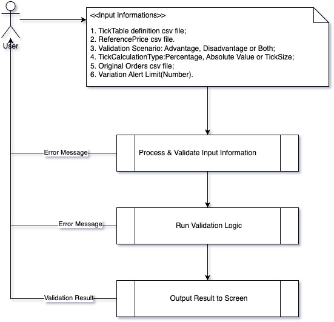
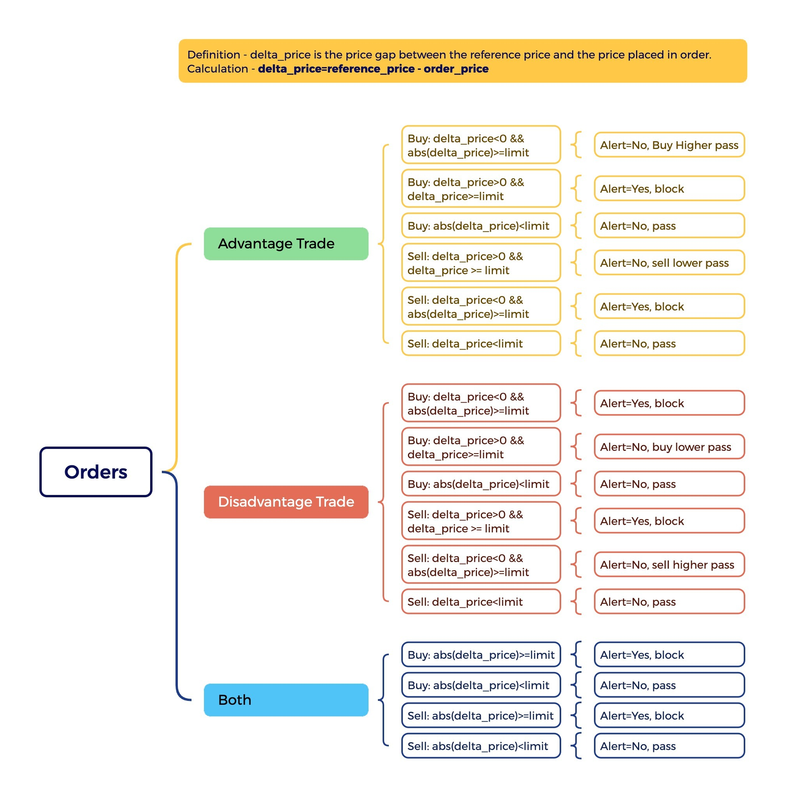
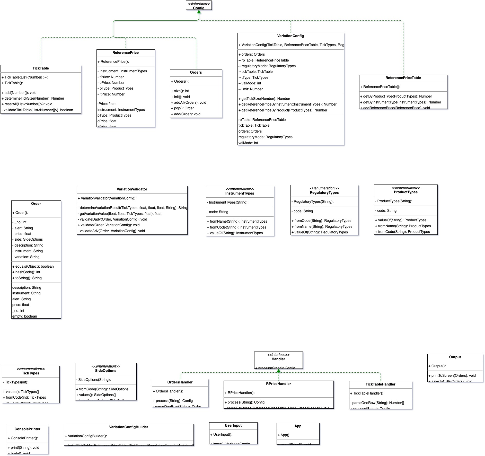
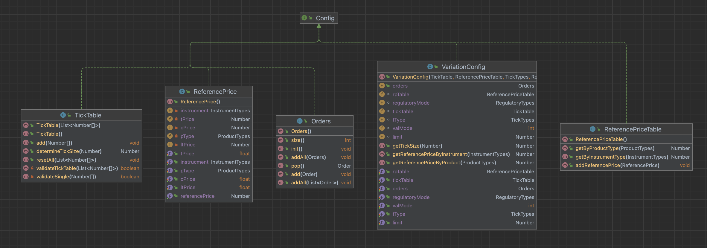
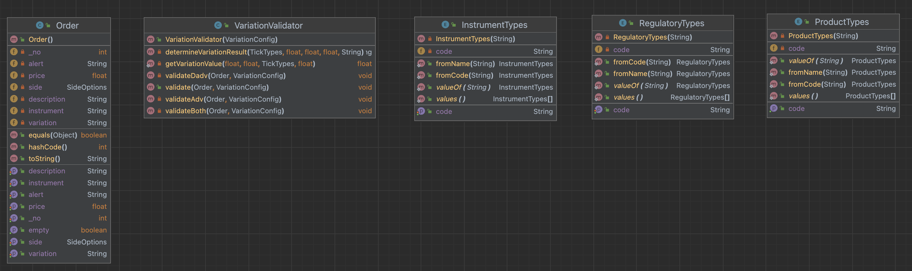
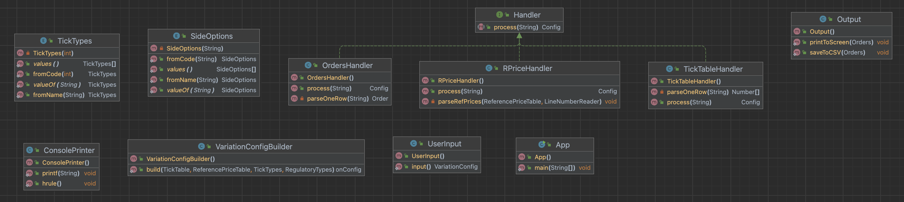

# code-exam
## I. compile & build
``` mvn clean package ``` OR
``` mvn clean install ```
## II. build & runtime info
| Tool  | Version Information            |
|-------|--------------------------------|
| OS    | mac os x<br/>version: "15.1.1" |
| Maven | Apache Maven 3.9.9             |
| JDK   | Java version: 23.0.1           |

## III. design
### 1. run workflow

### 2. variateion validation logic

### 3. class diagram
Full Diagram can be viewed in:

#### configuration classes: TickTable, ReferencePrice, Original Orders to be validated.

#### Utility, Pojo & Vailidate functions classes.

#### user Input/Output process classes.

#### Java documemnt
[Java Class Doc](./docs/allclasses-index.html)
## IVTest & Verification
Test files:
``` src/main/resources ```
## V. Assumptions:
1. The 'reference price' used by the variation validation logic is a user-input static number.
        if it gets updated at runtime by completed orders, 
        then this program needs to add a mechanism/classes/functions to get the updated 'reference price' at runtime.
2. The calculation method of the price gap between placed price in an order and the reference price is: 
**<center>**Δδ = ReferencePrice - OrderPrice**</center>**